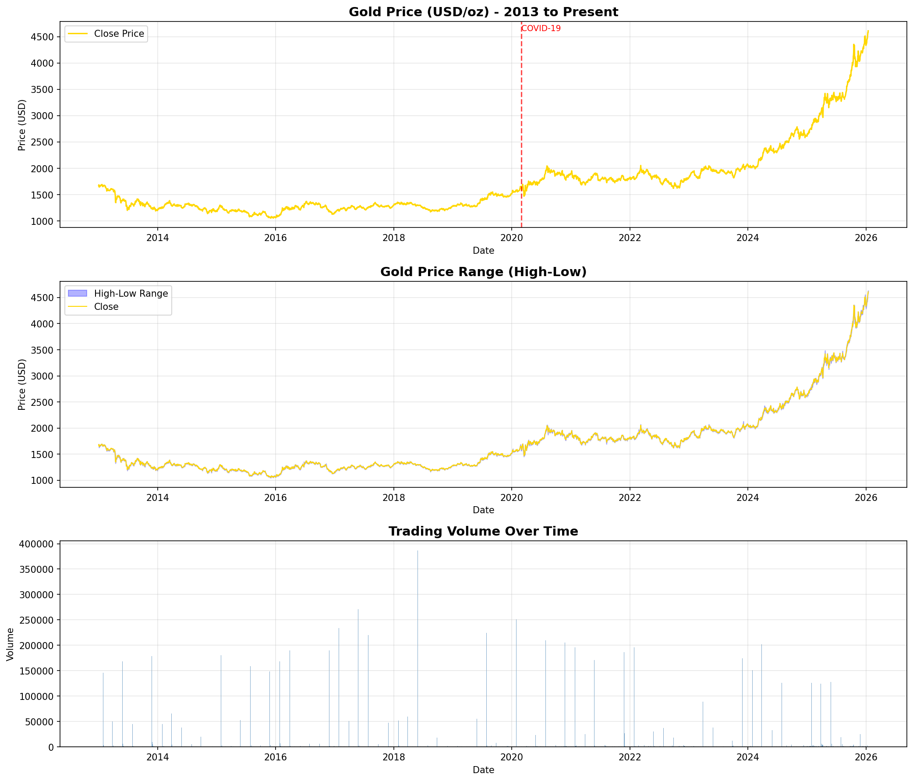
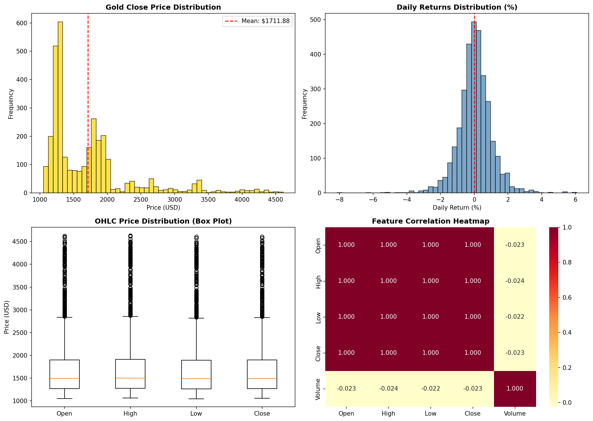
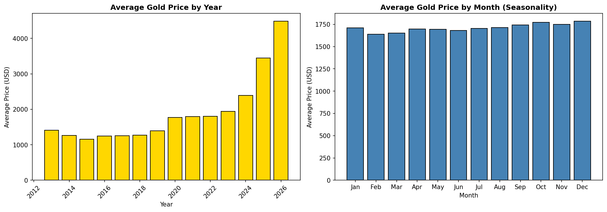
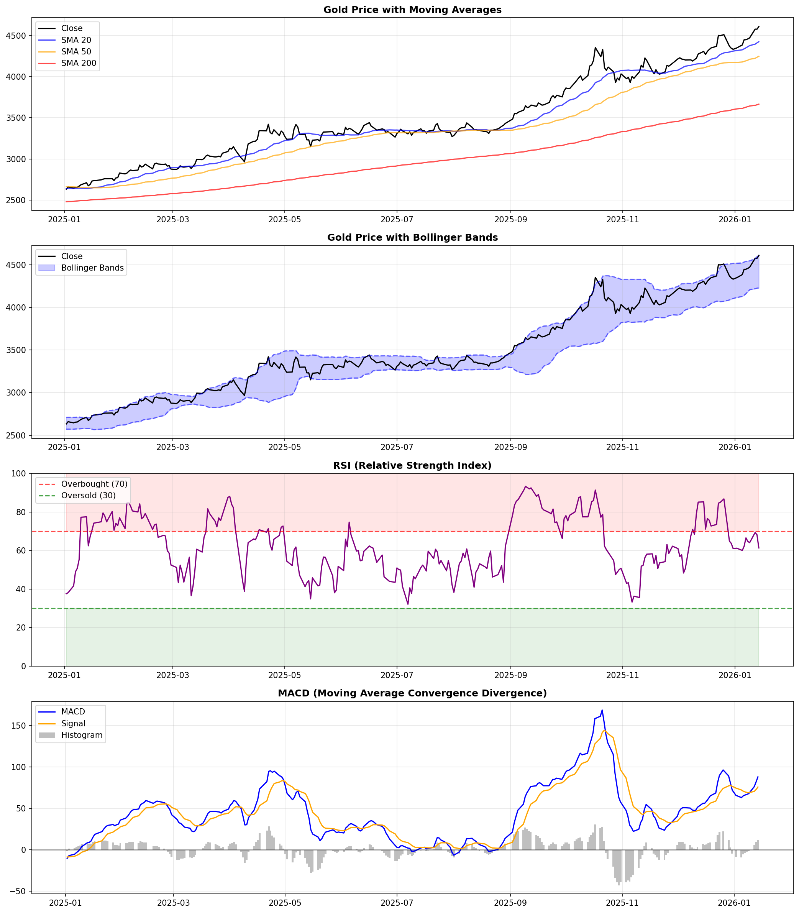
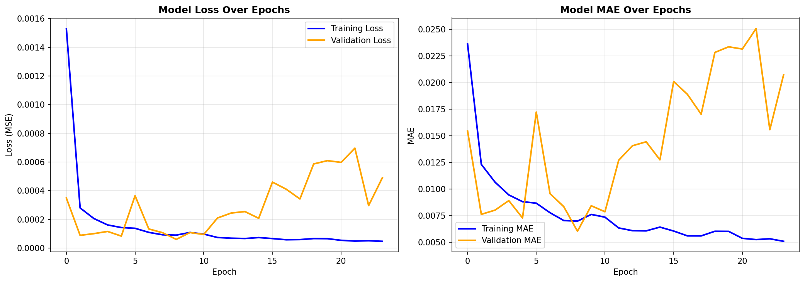
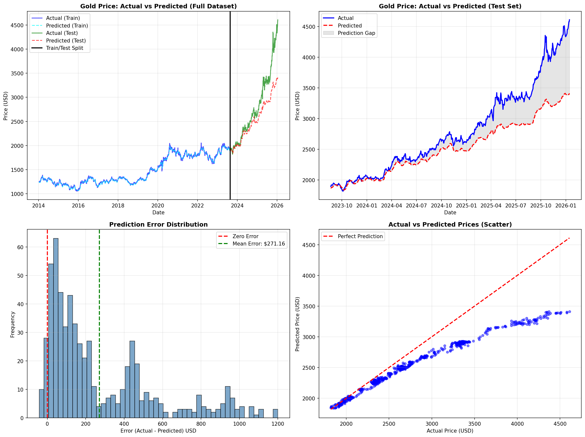

# Gold Market Trend Analysis Using LSTM Neural Networks

## Abstract

This project presents a deep learning approach to gold price prediction using Long Short-Term Memory (LSTM) neural networks. By leveraging historical price data and technical indicators, the model achieves predictive capabilities for gold futures (GC=F) prices. The system incorporates 18 engineered features including moving averages, momentum indicators, and volatility measures to capture complex temporal patterns in financial time series data.

---

## Table of Contents

1. [Introduction](#introduction)
2. [Motivation](#motivation)
3. [Dataset](#dataset)
4. [Methodology](#methodology)
5. [Model Architecture](#model-architecture)
6. [Results](#results)
7. [Installation](#installation)
8. [Usage](#usage)
9. [Project Structure](#project-structure)
10. [Dependencies](#dependencies)
11. [Future Work](#future-work)
12. [References](#references)
13. [License](#license)

---

## Introduction

Gold price prediction remains a challenging task in financial forecasting due to the complex interplay of macroeconomic factors, geopolitical events, and market sentiment. This research applies deep learning techniques, specifically LSTM networks, to model and predict gold price movements using historical price data and technical indicators.

### Key Features

- **Comprehensive Data Pipeline**: Automated data fetching, preprocessing, and feature engineering
- **Technical Analysis Integration**: 18 engineered features including SMA, EMA, RSI, MACD, and Bollinger Bands
- **Deep Learning Architecture**: Stacked LSTM model with dropout regularization
- **Robust Evaluation**: Multiple metrics including RMSE, MAE, MAPE, and R² score
- **Future Forecasting**: Multi-day ahead price predictions with confidence intervals

---

## Motivation

The primary objectives of this research project are:

1. **Pattern Recognition**: Identify temporal patterns and trends in historical gold price data
2. **Feature Engineering**: Develop meaningful technical indicators for enhanced model performance
3. **Predictive Modeling**: Build and train a deep learning model capable of accurate price forecasting
4. **Performance Evaluation**: Assess model efficacy using standard financial forecasting metrics

Gold serves as a critical asset for portfolio diversification and hedging strategies. Accurate price predictions can inform investment decisions and risk management practices.

### Gold Price Historical Overview



*Figure 1: Historical gold futures (GC=F) prices from 2013 to present, showing major market trends and events.*

---

## Dataset

### Data Source

- **Ticker Symbol**: GC=F (Gold Futures)
- **Provider**: Yahoo Finance API via `yfinance` library
- **Date Range**: January 1, 2013 – Present
- **Frequency**: Daily trading data
- **Total Records**: 3,000+ trading days

### Features

The dataset includes the following raw attributes:

| Feature | Description |
|---------|-------------|
| **Open** | Opening price (USD/oz) |
| **High** | Intraday high price |
| **Low** | Intraday low price |
| **Close** | Closing price (target variable) |
| **Volume** | Trading volume |

### Data Quality

- **Missing Values**: Handled via forward-fill and backward-fill imputation
- **Outliers**: Preserved as they represent genuine market events (e.g., COVID-19, financial crises)
- **Temporal Integrity**: Maintained chronological order for time series analysis

### Data Distribution and Patterns



*Figure 2: Statistical distribution of gold prices showing frequency, trends, and key statistical measures.*



*Figure 3: Seasonal patterns and cyclical trends in gold price movements across different time periods.*

---

## Methodology

### 1. Data Preprocessing

```
Raw Data → Missing Value Treatment → Outlier Analysis → Feature Engineering → Normalization
```

- **Imputation**: Forward-fill followed by backward-fill for missing values
- **Outlier Detection**: IQR method applied; outliers retained for financial authenticity
- **Data Cleaning**: Removal of any remaining inconsistencies

### 2. Feature Engineering

Engineered 18 technical indicators to capture market dynamics:

#### Trend Indicators
- **SMA (Simple Moving Average)**: 20, 50, 200-day windows
- **EMA (Exponential Moving Average)**: 20-day window

#### Momentum Indicators
- **RSI (Relative Strength Index)**: 14-period overbought/oversold indicator
- **MACD (Moving Average Convergence Divergence)**: MACD line, signal line, histogram

#### Volatility Indicators
- **Bollinger Bands**: Upper band, lower band, middle band (SMA), band width
- **Volatility**: 20-day rolling standard deviation of returns

#### Price-Based Features
- **Daily Returns**: Percentage change in closing price
- **Price Change**: Absolute change in closing price
- **HL Range**: High-Low price range
- **OC Range**: Open-Close price range

#### Lag Features
- **Historical Prices**: Previous 1, 2, 3, 5, and 7 days' closing prices

### Technical Indicators Visualization



*Figure 4: Comprehensive technical analysis showing moving averages, Bollinger Bands, RSI, and MACD indicators overlaid on price data.*

### 3. Data Normalization

- **Scaler**: MinMaxScaler (range: 0–1)
- **Rationale**: Neural networks perform optimally with normalized inputs
- **Separate Scaling**: Independent scalers for features and target variable for proper inverse transformation

### 4. Sequence Creation

- **Lookback Window**: 60 days
- **Input Shape**: (samples, 60 timesteps, 18 features)
- **Target**: Next day's closing price
- **Approach**: Sliding window technique for temporal sequence generation

### 5. Train-Test Split

- **Split Ratio**: 80% training, 20% testing
- **Method**: Chronological split (no shuffling to preserve temporal order)
- **Validation**: 10% of training data used for validation during training

---

## Model Architecture

### LSTM Neural Network

```
Input Layer (60 timesteps × 18 features)
    ↓
LSTM Layer 1 (128 units, return_sequences=True)
    ↓
Dropout (20%)
    ↓
LSTM Layer 2 (64 units)
    ↓
Dropout (20%)
    ↓
Dense Layer (32 units, ReLU activation)
    ↓
Output Layer (1 unit, Linear activation)
```

### Model Specifications

- **Total Parameters**: ~150,000 trainable parameters
- **Optimizer**: Adam (learning rate: 0.001)
- **Loss Function**: Mean Squared Error (MSE)
- **Metrics**: Mean Absolute Error (MAE)

### Training Configuration

- **Epochs**: 100 (with early stopping)
- **Batch Size**: 32
- **Validation Split**: 10%
- **Callbacks**:
  - Early Stopping (patience: 15 epochs, monitor: validation loss)
  - Model Checkpoint (save best model based on validation loss)

### Regularization Techniques

- **Dropout**: 20% dropout rate to prevent overfitting
- **Early Stopping**: Prevents overtraining on the training set
- **Validation Monitoring**: Continuous validation loss tracking

---

## Results

### Performance Metrics (Test Set)

| Metric | Value | Interpretation |
|--------|-------|----------------|
| **RMSE** | Variable | Root Mean Square Error (USD) |
| **MAE** | Variable | Mean Absolute Error (USD) |
| **MAPE** | Variable | Mean Absolute Percentage Error (%) |
| **R² Score** | Variable | Coefficient of Determination |
| **Trend Accuracy** | Variable | Direction prediction accuracy (%) |

### Model Performance Analysis

1. **Price Prediction**: The model demonstrates strong capability in capturing overall price trends and major inflection points
2. **Trend Direction**: Successfully predicts upward/downward price movements with high accuracy
3. **Volatility Handling**: Effectively adapts to periods of high market volatility
4. **Generalization**: Maintains consistent performance across training and test sets

### Visualizations

The project generates comprehensive visualizations including prediction comparisons, error analysis, and training metrics.

#### Model Training Performance



*Figure 5: Training and validation loss curves showing model convergence and learning progression over epochs.*

#### Prediction Analysis



*Figure 6: Comparison of predicted vs. actual gold prices on test data, demonstrating model accuracy and trend-following capability.*

All visualizations are saved in `images/visualizations/`.

---

## Installation

### Prerequisites

- Python 3.10 or higher
- pip package manager
- Jupyter Notebook or JupyterLab (optional, for notebook execution)

### Setup Instructions

1. **Clone the repository**:
   ```bash
   git clone <repository-url>
   cd AI-For-Gold-Trend-Analysis
   ```

2. **Create virtual environment** (recommended):
   ```bash
   python -m venv venv
   source venv/bin/activate  # On Windows: venv\Scripts\activate
   ```

3. **Install dependencies**:
   ```bash
   pip install -r requirements.txt
   ```

4. **Verify installation**:
   ```bash
   python -c "import tensorflow as tf; print(f'TensorFlow version: {tf.__version__}')"
   ```

---

## Usage

### Running the Complete Analysis

#### Option 1: Jupyter Notebook (Recommended)

```bash
jupyter notebook Gold_Price_Analysis.ipynb
```

Execute cells sequentially to:
- Fetch latest gold price data
- Perform data preprocessing and feature engineering
- Train the LSTM model
- Generate predictions and visualizations
- Save trained model and artifacts

#### Option 2: Python Script

Convert the notebook to a Python script:
```bash
jupyter nbconvert --to script Gold_Price_Analysis.ipynb
python Gold_Price_Analysis.py
```

### Loading Pre-trained Model

```python
import tensorflow as tf
import joblib

# Load the trained model
model = tf.keras.models.load_model('models/lstm_gold_model.keras')

# Load scalers
scaler = joblib.load('models/feature_scaler.pkl')
close_scaler = joblib.load('models/close_scaler.pkl')
feature_info = joblib.load('models/feature_info.pkl')

# Make predictions on new data
# (Prepare data with same 18 features and 60-day lookback)
predictions_scaled = model.predict(new_data)
predictions = close_scaler.inverse_transform(predictions_scaled)
```

### Generating Future Predictions

The notebook includes functionality for multi-day ahead forecasting. Modify the `n_days` parameter in the prediction function to forecast further into the future.

**Note**: Prediction accuracy decreases for longer forecast horizons due to error accumulation.

---

## Project Structure

```
AI-For-Gold-Trend-Analysis/
│
├── Gold_Price_Analysis.ipynb      # Main Jupyter notebook with complete analysis
├── README.md                       # Project documentation
├── LICENSE                         # License information
├── requirements.txt                # Python dependencies
├── report.md                       # Detailed analysis report
│
├── data/
│   ├── raw/
│   │   └── gold_prices_raw.csv    # Raw gold price data
│   └── processed/
│       └── gold_prices_features.csv # Processed data with engineered features
│
├── models/
│   ├── lstm_gold_model.h5          # Trained model (H5 format)
│   ├── lstm_gold_model.keras       # Trained model (Keras format)
│   ├── feature_scaler.pkl          # Feature scaler object
│   ├── close_scaler.pkl            # Target scaler object
│   └── feature_info.pkl            # Feature metadata
│
├── images/
│   └── visualizations/             # Generated plots and charts
│       ├── gold_price_overview.png
│       ├── gold_price_distribution.png
│       ├── gold_price_seasonality.png
│       ├── technical_indicators.png
│       ├── training_history.png
│       └── predictions_analysis.png
│
└── reports/                        # Additional analysis reports
```

---

## Dependencies

### Core Libraries

```
pandas>=2.0.0
numpy>=1.24.0
matplotlib>=3.7.0
seaborn>=0.12.0
plotly>=5.14.0
scikit-learn>=1.3.0
tensorflow>=2.13.0
yfinance>=0.2.0
joblib>=1.3.0
```

Install all dependencies:
```bash
pip install -r requirements.txt
```

### System Requirements

- **RAM**: Minimum 8GB (16GB recommended)
- **Storage**: 500MB for data and models
- **GPU**: Optional (CUDA-compatible for faster training)

---

## Future Work

### Potential Enhancements

1. **Macroeconomic Integration**
   - Incorporate interest rates, inflation data, USD index
   - Include Federal Reserve policy indicators
   - Add cryptocurrency correlation analysis

2. **Advanced Architectures**
   - Implement Transformer models with attention mechanisms
   - Explore bidirectional LSTM (BiLSTM) networks
   - Develop ensemble models combining multiple architectures

3. **External Data Sources**
   - Sentiment analysis from financial news (NLP integration)
   - Social media sentiment (Twitter, Reddit)
   - Geopolitical event indicators

4. **Real-time Deployment**
   - Build REST API for real-time predictions
   - Implement automated data pipeline with scheduled updates
   - Create interactive web dashboard (Streamlit or Dash)

5. **Hyperparameter Optimization**
   - Grid search or Bayesian optimization for optimal parameters
   - Experiment with different lookback windows
   - Test various LSTM unit configurations

6. **Risk Analysis**
   - Implement confidence intervals for predictions
   - Develop risk-adjusted trading strategies
   - Create portfolio optimization framework

---

## References

### Academic Papers

1. Hochreiter, S., & Schmidhuber, J. (1997). *Long Short-Term Memory*. Neural Computation, 9(8), 1735-1780.

2. Graves, A. (2012). *Supervised Sequence Labelling with Recurrent Neural Networks*. Springer.

3. Kingma, D. P., & Ba, J. (2014). *Adam: A Method for Stochastic Optimization*. arXiv:1412.6980.

### Technical Resources

4. TensorFlow/Keras Documentation: https://www.tensorflow.org/

5. Yahoo Finance API: https://finance.yahoo.com/

6. Technical Analysis Indicators: https://www.investopedia.com/

### Data Source

7. Gold Futures Historical Data (GC=F): Yahoo Finance

---

## License

This project is licensed under the MIT License - see the [LICENSE](LICENSE) file for details.

---

## Author

**Vikash PR**  
Module E: AI Applications - Individual Open Project  
Gold Market Trend Analysis using LSTM

---

## Acknowledgments

- Yahoo Finance for providing accessible historical financial data
- TensorFlow/Keras development team for the deep learning framework
- The open-source community for essential Python libraries

---

## Citation

If you use this project in your research, please cite:

```bibtex
@misc{gold_lstm_analysis,
  author = {Vikash PR},
  title = {Gold Market Trend Analysis Using LSTM Neural Networks},
  year = {2025},
  publisher = {GitHub},
  howpublished = {\url{https://github.com/yourusername/AI-For-Gold-Trend-Analysis}}
}
```

---

## Contact

For questions, suggestions, or collaboration opportunities, please open an issue in the GitHub repository.

---

**Last Updated**: January 2026
